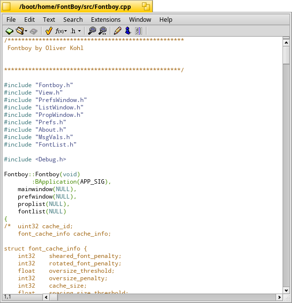

Pe
==

Pe is a programmer's editor for Haiku.

It features syntax highlighting and a structural view for several programming 
language, as well as basic support for Makefile and Jamfile project management.
